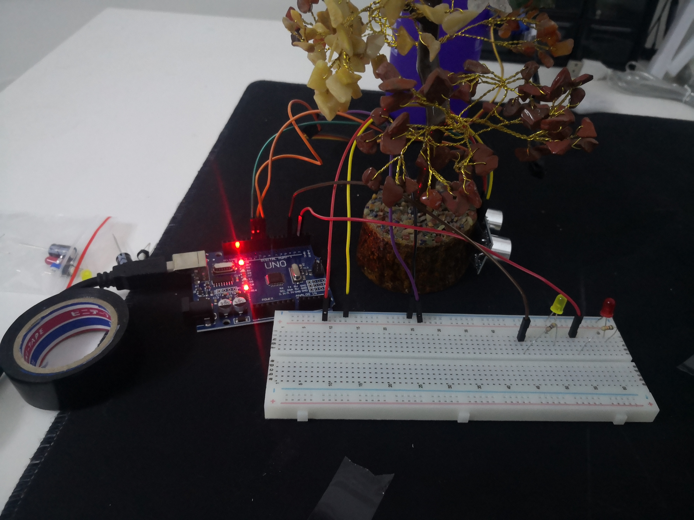
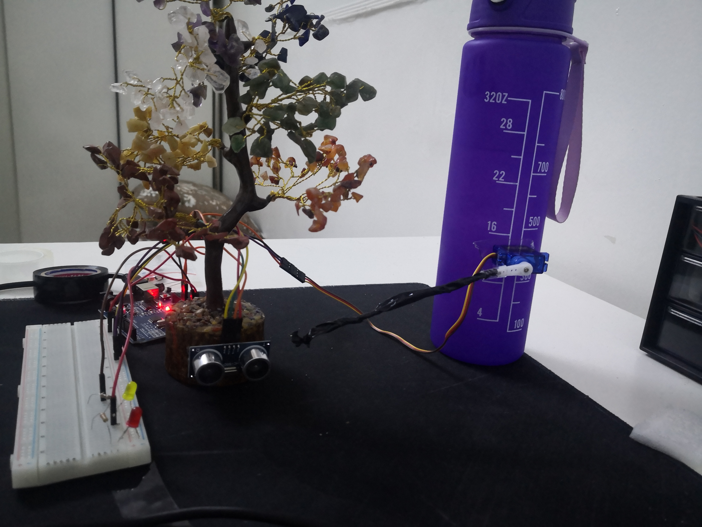

# Smart Gate — بوابة العبور الذكية


> **المستودع:** [HZCS-IoT/Electronics-task3](https://github.com/HZCS-IoT/Electronics-task3)  
> مشروع إلكترونيات — Smart Methods · **تنفيذ فعلي (Real Hardware)**

---

## 📖 نبذة عن المشروع

**Smart Gate** (بوابة العبور الذكية) هو نظام تحكم آلي مبني على **Arduino Uno** و**مُنفَّذ فعلياً** على قطع حقيقية — ليس محاكاة. يعمل كبوابة مرور ذكية تفتح وتغلق تلقائياً عند اقتراب الأجسام.

يعتمد المشروع على:

- **حساس المسافة بالموجات فوق الصوتية (HC-SR04)** لقياس المسافة أمام البوابة.
- **محرك السيرفو (Servo Motor)** لتحريك ذراع البوابة (فتح / إغلاق).
- **نظام إضاءة تنبيهي** بلمبتين:
  - 🔴 **لمبة حمراء** → البوابة **مغلقة** (الوضع الطبيعي).
  - 🟡 **لمبة صفراء** → البوابة **مفتوحة** (عند اقتراب جسم).

عند اقتراب جسم لمسافة **10 سم أو أقل**، ترتفع البوابة وتضيء اللمبة الصفراء. وعند ابتعاد الجسم، تعود البوابة للوضع المغلق وتضيء اللمبة الحمراء.

---

## 📁 ملفات المشروع

| الملف | النوع | الوصف |
|-------|-------|-------|
| [`code/code.ino`](code/code.ino) | كود Arduino | البرنامج الرئيسي للبوابة الذكية |
| [`pic1.jpg`](pic1.jpg) | صورة | صورة حقيقية للمشروع — منظر عام |
| [`pic2.jpg`](pic2.jpg) | صورة | صورة حقيقية — تفاصيل التوصيل والمكونات |
| [`smartgate.mp4`](smartgate.mp4) | فيديو | عرض عملي للمشروع على الأرض |

---

## 🧰 المكونات والأدوات المستخدمة

| # | المكون | الكمية | الوظيفة |
|---|--------|--------|---------|
| 1 | **Arduino Uno R3** | 1 | وحدة التحكم الرئيسية |
| 2 | **HC-SR04 Ultrasonic Sensor** | 1 | قياس المسافة أمام البوابة |
| 3 | **Servo Motor (SG90)** | 1 | تحريك ذراع البوابة (فتح / إغلاق) |
| 4 | **Red LED** | 1 | إشارة — البوابة مغلقة |
| 5 | **Yellow LED** | 1 | إشارة — البوابة مفتوحة |
| 6 | **Resistor 220Ω** | 2 | حماية اللمبات من التيار الزائد |
| 7 | **Breadboard** | 1 | تركيب الدائرة الإلكترونية |
| 8 | **Jumper Wires** | — | أسلاك التوصيل بين المكونات |
| 9 | **كابل USB** | 1 | تغذية Arduino ورفع الكود |

---

## 🔌 مخطط التوصيل والدوائر

### جدول التوصيلات (Pin Mapping)

| المكون | الطرف | Arduino Pin | ملاحظات |
|--------|-------|-------------|---------|
| **HC-SR04** | TRIG (إرسال) | **Pin 10** | Output — يرسل نبضة ultrasonic |
| **HC-SR04** | ECHO (استقبال) | **Pin 11** | Input — يستقبل صدى الموجة |
| **HC-SR04** | VCC | **5V** | تغذية الحساس |
| **HC-SR04** | GND | **GND** | أرضي مشترك |
| **Servo Motor** | Signal (برتقالي) | **Pin 9** | PWM — التحكم بزاوية البوابة |
| **Servo Motor** | VCC (أحمر) | **5V** | تغذية السيرفو |
| **Servo Motor** | GND (أسود/بني) | **GND** | أرضي مشترك |
| **Red LED** | Anode (+) → مقاومة 220Ω | **Pin 2** | Output — بوابة مغلقة |
| **Red LED** | Cathode (−) | **GND** | |
| **Yellow LED** | Anode (+) → مقاومة 220Ω | **Pin 4** | Output — بوابة مفتوحة |
| **Yellow LED** | Cathode (−) | **GND** | |

### مخطط التوصيل المبسّط

```
                    ┌─────────────┐
                    │ Arduino Uno │
                    │             │
   HC-SR04 TRIG ────┤ Pin 10      │
   HC-SR04 ECHO ────┤ Pin 11      │
   Servo Signal ────┤ Pin 9       │
   Red LED ─────────┤ Pin 2       │
   Yellow LED ──────┤ Pin 4       │
   5V / GND ────────┤ Power       │
                    └─────────────┘
```

> **تنبيه:** يُوصى بتوصيل مقاومة **220Ω** على الطرف الموجب (Anode) لكل LED قبل الوصل إلى Arduino.

---

## 💻 شرح الكود البرمجي

**الملف:** [`code/code.ino`](code/code.ino)

### 1. المكتبات والتعريفات

```cpp
#include <Servo.h>

#define RED_LED_PIN    2
#define YELLOW_LED_PIN 4
#define SERVO_PIN      9
#define TRIG_PIN       10
#define ECHO_PIN       11

const int DISTANCE_THRESHOLD = 10;  // مسافة التفعيل: 10 سم
const int GATE_CLOSED_ANGLE  = 0;   // البوابة مغلقة
const int GATE_OPEN_ANGLE    = 180; // البوابة مفتوحة
```

- يُعرَّف **Servo** للتحكم بزاوية البوابة.
- **DISTANCE_THRESHOLD = 10** → عتبة التفعيل بالسنتيمتر.

---

### 2. دالة قياس المسافة `getDistance()`

```cpp
long getDistance() {
  digitalWrite(TRIG_PIN, LOW);
  delayMicroseconds(2);
  digitalWrite(TRIG_PIN, HIGH);
  delayMicroseconds(10);
  digitalWrite(TRIG_PIN, LOW);

  long duration = pulseIn(ECHO_PIN, HIGH, 30000);
  if (duration == 0) return 999;
  return duration * 0.034 / 2;
}
```

- ترسل نبضة من **TRIG** وتستقبل الصدى على **ECHO**.
- تحسب المسافة بالسنتيمتر: `duration × 0.034 / 2`.

---

### 3. الإعداد الأولي `setup()`

- تهيئة الحساس واللمبات والسيرفو.
- البوابة تبدأ **مغلقة** (زاوية 0°).
- 🔴 **اللمبة الحمراء** مشغّلة — 🟡 **الصفراء** مطفأة.

---

### 4. الدورة الرئيسية `loop()` — منطق الشروط

| الشرط | السيرفو | 🔴 Red LED | 🟡 Yellow LED |
|-------|---------|------------|---------------|
| **مسافة ≤ 10 سم** | يفتح (180°) | OFF | **ON** |
| **مسافة > 10 سم** | يغلق (0°) | **ON** | OFF |

```cpp
if (distance <= DISTANCE_THRESHOLD && distance > 0) {
  gateServo.write(GATE_OPEN_ANGLE);      // فتح البوابة
  digitalWrite(RED_LED_PIN, LOW);
  digitalWrite(YELLOW_LED_PIN, HIGH);    // إشارة: مفتوحة
} else {
  gateServo.write(GATE_CLOSED_ANGLE);    // إغلاق البوابة
  digitalWrite(RED_LED_PIN, HIGH);       // إشارة: مغلقة
  digitalWrite(YELLOW_LED_PIN, LOW);
}
```

---

### 5. مخطط تدفق المنطق

```
        ┌──────────────┐
        │  قياس المسافة │
        └──────┬───────┘
               ▼
      مسافة ≤ 10 سم؟
        ╱         ╲
      نعم          لا
       ▼            ▼
  فتح البوابة    إغلاق البوابة
  🟡 ON / 🔴 OFF  🔴 ON / 🟡 OFF
```

---

## 🖼️ صور المشروع (تنفيذ فعلي)

### صورة 1 — منظر عام للمشروع



> **pic1:** صورة للمشروع المُنفَّذ فعلياً — تُظهر Arduino والمكونات وذراع البوابة.

---

### صورة 2 — تفاصيل التوصيل



> **pic2:** صورة مقرّبة لتوصيل الأسلاك والمكونات الحقيقية — الحساس، السيرفو، واللمبات.

---

## 🎬 فيديو العرض العملي

<video src="smartgate.mp4" controls width="720"></video>

> [▶ مشاهدة / تحميل فيديو العرض (smartgate.mp4)](smartgate.mp4)

---

## 🚀 طريقة التشغيل (Hardware)

### 1. تجميع الدائرة

1. ركّب المكونات على **Breadboard** حسب جدول التوصيلات أعلاه.
2. تأكد من توصيل **GND** مشترك بين كل المكونات.
3. أضف **مقاومة 220Ω** أمام كل LED.

### 2. رفع الكود على Arduino

1. حمّل [Arduino IDE](https://www.arduino.cc/en/software).
2. افتح ملف [`code/code.ino`](code/code.ino).
3. وصّل **Arduino Uno** بالكمبيوتر عبر **كابل USB**.
4. اختر **Tools → Board → Arduino Uno**.
5. اختر **Tools → Port → COMx** (المنفذ الصحيح).
6. اضغط **Upload** ⬆ لرفع البرنامج.

### 3. التجربة

1. بعد الرفع، يبدأ Arduino بالعمل مباشرة.
2. قرّب يدك أو أي جسم من **HC-SR04** لمسافة **10 سم أو أقل**.
3. راقب: البوابة تفتح 🟡 واللمبة الصفراء تضيء.
4. ابعد الجسم: البوابة تغلق 🔴 واللمبة الحمراء تضيء.

> **ملاحظة:** يمكنك فتح **Serial Monitor** (9600 baud) لمتابعة قراءات المسافة بالسنتيمتر.

---

## 📌 ملخص سريع

| الحالة | المسافة | البوابة | الإضاءة |
|--------|---------|---------|---------|
| **طبيعي** | > 10 سم | مغلقة (0°) | 🔴 حمراء |
| **عبور** | ≤ 10 سم | مفتوحة (180°) | 🟡 صفراء |

---

<p align="center">
  <sub>Smart Gate · HZCS-IoT · Smart Methods · Electronics Task 3 · Real Hardware</sub>
</p>
